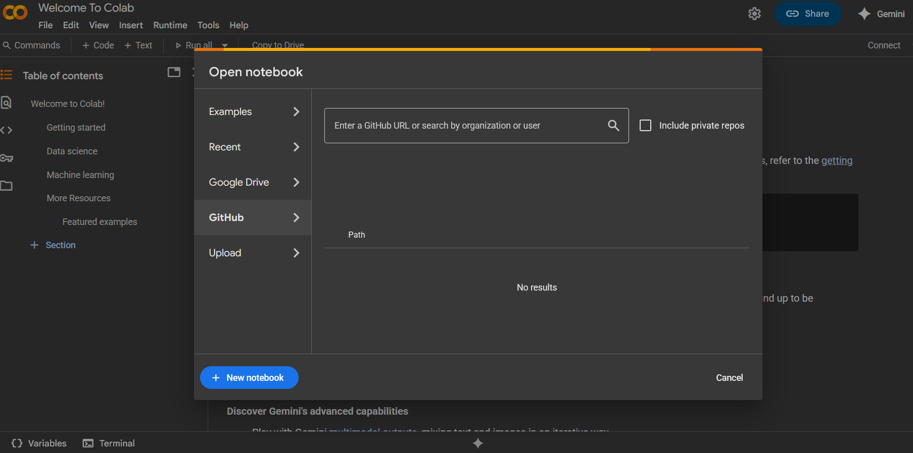
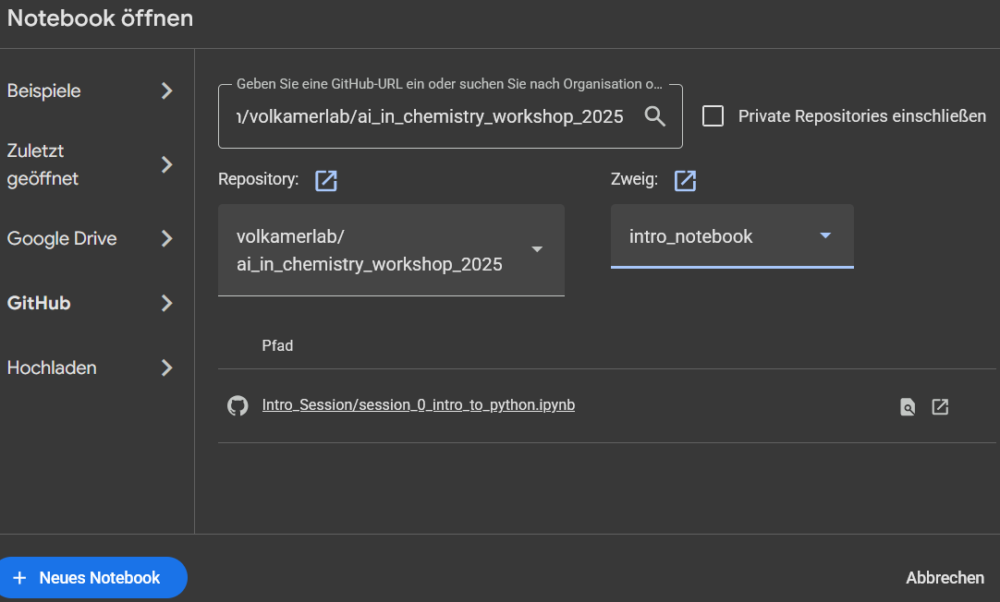

## How to run a jupyter notebook using Google Colab

1. Open Google Colab: [https://colab.research.google.com/](https://colab.research.google.com/)
2. Click GitHub

3. Enter [https://github.com/volkamerlab/ai_in_chemistry_workshop_2025](https://github.com/volkamerlab/ai_in_chemistry_workshop_2025) in the search field.

4. Select a Notebook by clicking on the name. For the "Introduction to Python Session" choose ``Intro_Session/session_0_intro_to_python.ipynb``.